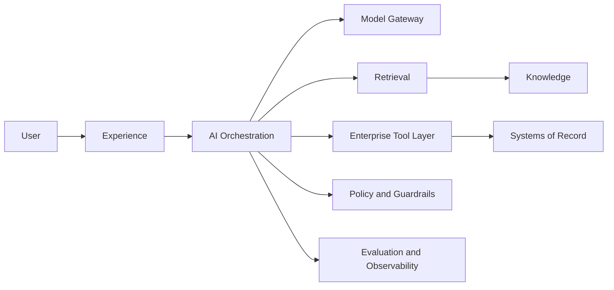

# Design an Enterprise RAG Platform

## Interview prompt
A company-wide assistant answering policies, technical docs, product manuals, and internal knowledge while preserving document permissions.

## Constraints
- 100,000 employees
- 10 million documents
- RBAC/ACLs
- Citations required
- Daily updates
- p95 under 5 seconds

## Strong answer structure
1. Clarify users, workflow, and measurable outcome.
2. Identify systems of record and data ownership.
3. Separate deterministic services from probabilistic components.
4. Define identity, authorization, and trust boundaries.
5. Add retrieval/models/agents only where justified.
6. Define human review for risky actions.
7. Cover evaluation, observability, failure modes, scale, and cost.
8. Explain alternatives and rollout.

## Baseline whiteboard

## Follow-ups
- Highest-risk failure mode?
- Where is human approval required?
- What would you cache?
- How do you handle model/provider change?
- What launch metrics matter?
