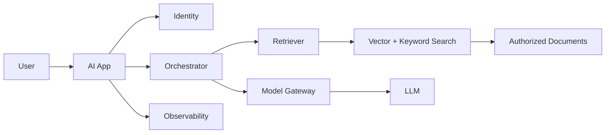
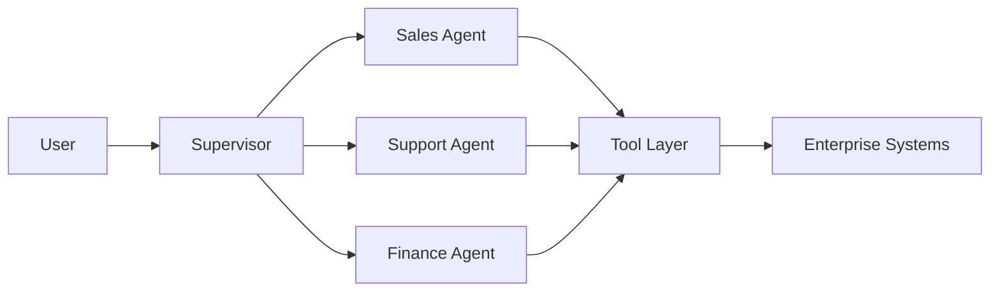
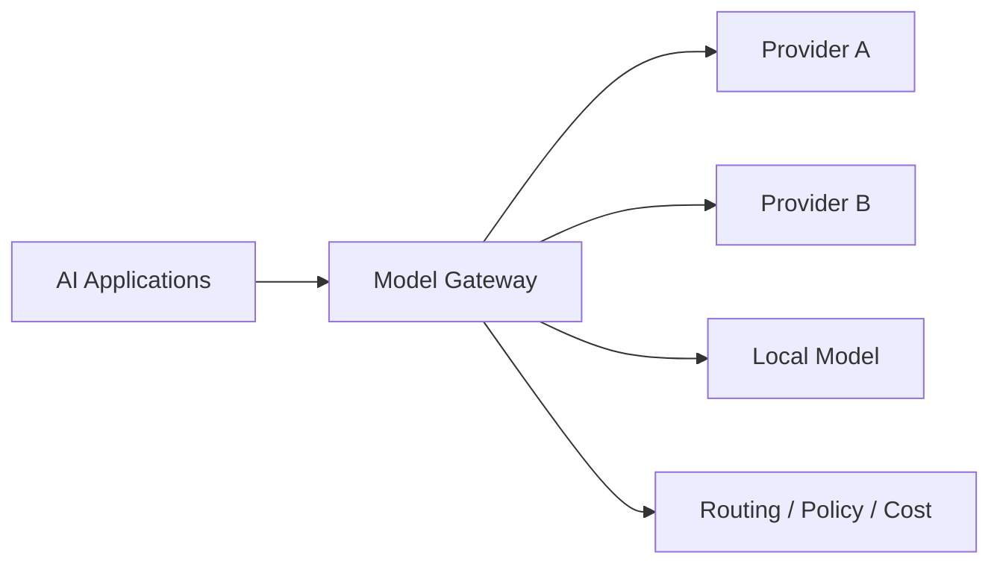

# Reference Architecture Patterns

## Enterprise RAG

```mermaid
flowchart LR
 U[User] --> A[AI App]
 A --> I[Identity]
 A --> Q[Orchestrator]
 Q --> R[Retriever]
 R --> V[Vector + Keyword Search]
 V --> D[Authorized Documents]
 Q --> G[Model Gateway]
 G --> L[LLM]
 A --> O[Observability]
```

## Supervisor + Specialists

```mermaid
flowchart LR
 U[User] --> S[Supervisor]
 S --> A1[Sales Agent]
 S --> A2[Support Agent]
 S --> A3[Finance Agent]
 A1 --> T[Tool Layer]
 A2 --> T
 A3 --> T
 T --> E[Enterprise Systems]
```

## Model Gateway

```mermaid
flowchart LR
 A[AI Applications] --> G[Model Gateway]
 G --> P1[Provider A]
 G --> P2[Provider B]
 G --> L[Local Model]
 G --> C[Routing / Policy / Cost]
```
